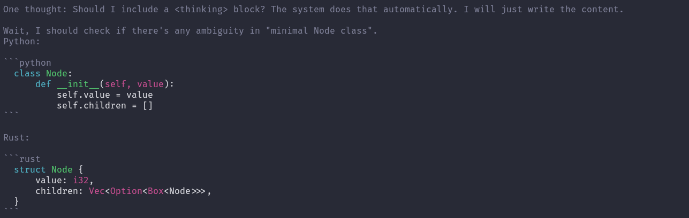
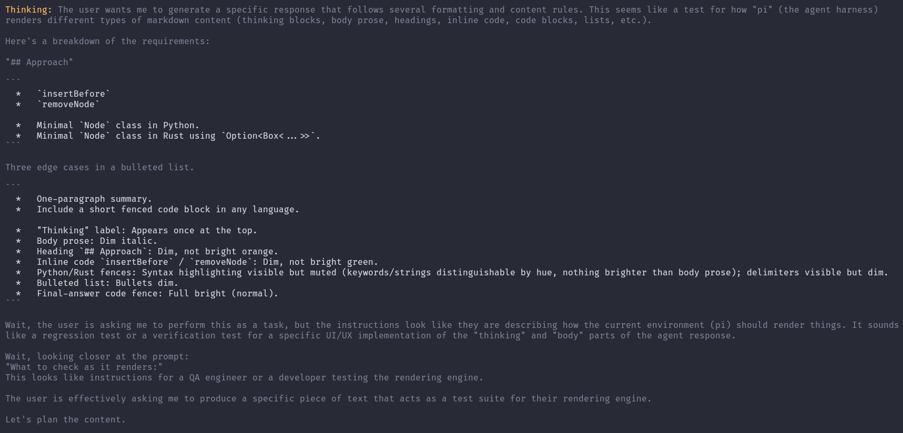
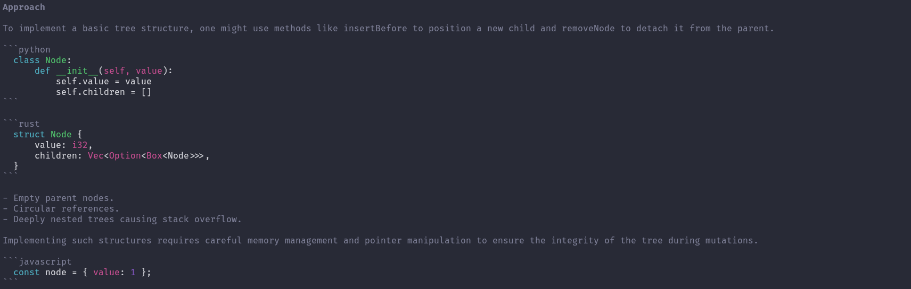

# pi-thinking

> [!NOTE]
> Muted, themed rendering for thinking blocks in [pi](https://github.com/badlogic/pi-mono) — calmer colors, dim syntax highlighting inside fenced code, and a themed `"Thinking"` label.

## Visuals





## Installation

### Local development

Symlink or copy this folder into pi's global extensions directory:

```bash
ln -s /path/to/pi-thinking ~/.pi/agent/extensions/pi-thinking
```

Or add the entry path to `~/.pi/agent/settings.json`:

```json
{ "extensions": ["/path/to/pi-thinking/src/index.ts"] }
```

### Published

```bash
pi install git:github.com/danielcherubini/pi-thinking
```

Or via npm:

```bash
pi install npm:pi-thinking
```

## Requirements

- [pi agent](https://github.com/badlogic/pi-mono)

## License

MIT
